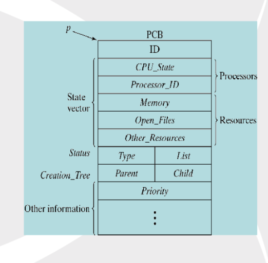
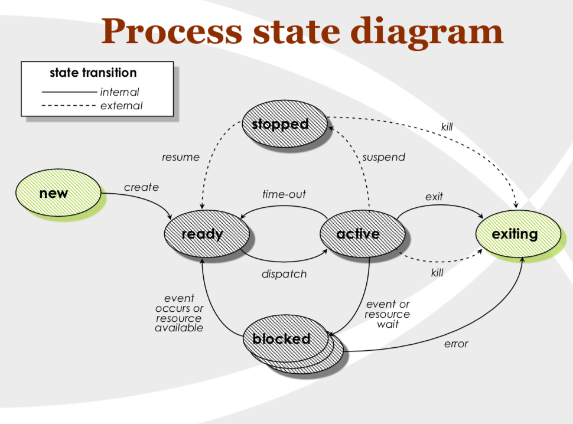
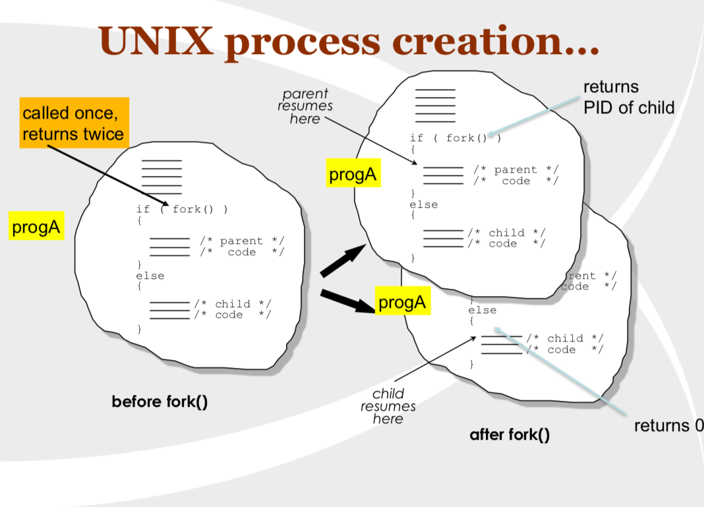

# System, Concurrency, Inter-Process Communication

### System Programming

- C is a system language, which means it can access directly to the memory and the devices connected to the computer
- There are various C libraries interact with OS directly. i.e. `time.h`

### Concurrency Programs
- Two programs are running at the same time
  - QQ Music, IDE, Chrome
  - They can be independent, or communicate with each other
- **;** - run commands sequentially
- **&** - run commands concurrently

##### Run Process Concurrently
```
# sequential executions
ls; cp file1.c /backup; cat file1.c

# concurrent executions
ls & cp file1.c /backup & cat file1.c
```

##### Process Command
- `ps`: see all the currently running processes
  ```
  -a : all processes, all users
  -e : environment/everything
  -g : process group leaders as well
  -l : long format
  -u : user oriented report
  -x : even processes not executed from terminals
  -f : full listing
  ```
- `kill`: kill a specific process

###### Code example
```
$  jiajunchen@MacBook-Pro-2  ~/Desktop/Comp206/gprof_gdb   master ●  ps

  PID TTY           TIME CMD
13094 ttys000    0:00.06 /Users/jiajunchen/Applications/iTerm.app/Contents/MacOS/iTerm2 --server login -fp jiajunchen
13096 ttys000    0:02.05 -zsh


~/Desktop/Comp206/gprof_gdb  sl&

[1] 39203
[1]  + 39203 suspended (tty output)  sl

 ~/Desktop/Comp206/gprof_gdb  ps
  PID TTY           TIME CMD
13094 ttys000    0:00.06 /Users/jiajunchen/Applications/iTerm.app/Contents/MacOS/iTerm2 --server login -fp jiajunchen
13096 ttys000    0:02.08 -zsh
39203 ttys000    0:00.01 sl

~/Desktop/Comp206/gprof_gdb   kill 39203
[1]  + 39203 terminated  sl

 ~/Desktop/Comp206/gprof_gdb  ps
  PID TTY           TIME CMD
13094 ttys000    0:00.06 /Users/jiajunchen/Applications/iTerm.app/Contents/MacOS/iTerm2 --server login -fp jiajunchen
13096 ttys000    0:02.09 -zsh
```
### Inter-Process Communication

Definition of Process
- a program in execution and in RAM




Three types of process
- shell processes
  - process runs within its own shell. Launching a process of this form will pause the current shell by launching a new shell and then using the command-line of the new shell to launch a program or execute a shell command. (system())
- cloned processes
  - current process can clone itself, both process running in the same shell concurrently after the clone (fork())
- new processes
  - current process launch a new process within current shell, both processes runs concurrently

How can two processes communicate with each other
1. File
2. Piping
3. shared memory
3. Environment Variable
4. ...

##### system()

`system()` will invoke your systems default command shell, which will execute the command string passed as an argument. The current program will wait until the `system()` is finished

##### fork()

A fork gives you a brand new process, which is a copy of the current process, with the same code segments. It is a different process with different process ID and having it’s own memory.




###### Demo Time
