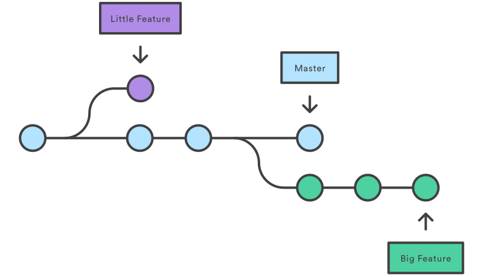

# Git and Version Control

### VCS - Version Control System
- allows develoeprs to work on a project simulataneously
- Does not allow overwriting each other's changes
- Maintains a history of every version

### Basic Workflow
1. You modify a file from the working directory
2. You add these files to the staging area.
3. You perform commit operation that moves the files from the staging area. It creates a commit history and to the Git repository.
4. You perform a push operation, you local repository data is pushed to remote repository.

### Git Basic Explain

- **Working Directory**
  - In short, your project directory
- **Staging area**
  - a place where files are ready to be commited into repository
  - why have staging? you may only want to commit certain files into the repository.
- **repository**
  - where all the history(commits, branches) of the project is stored.
- **commit**
  - a code change history/log,
  - `commit_id`, `files changing history`, `a commit message`

### Basic Commands

- `git init ` create a local repository in current directory
- `git add <files or directories>` add files or directories into staging
- `git commit ` commit files in staging into local repository
- `git commit -m '<commit msg>'` commit files in staging into local repository, with a commit message
- `git log (- <number>)` show all/(number of) commit histories
- `git checkout <SHA>` go back to a specific commit
- `git diff <file_1> <fille_2>` see the differences between two files

### Project Managemebt and Collabration

#### Git Branch
- Usually branch is used so different people can work on different features without impacting each other
- A branch represents an independent line of development
- **working branch** - current branch you are working on. You can assume each branch has its own working directory (even they all use the same directory on your computer)

### Branch and Collabration Commands
- `git clone <url>` clone a remote repository
- `git push`
- `git pull`
- `git branch` list all branch
- `git branch <branch_name>` create a new local branch
- `git checkout <branch_name>` switch to the branch
- `git checkout –b <new_branch_name>` create and switch to the newly created branch
- `git branch -d <branch_name>` delete a local branch
- `git merge <branch_name` merge a branch into current working branch
